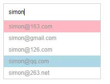

#### demo
- [EmailTips.html](https://zpp-github.github.io/ife/10%E3%80%81%E9%82%AE%E4%BB%B6/EmailTips.html)

### 邮箱提示功能
#### 1、基础
##### 代码片段
```html
<div class="wrapper">
    <input id="email-input" type="text">
    <ul id="email-sug-wrapper" class="email-sug"></ul>
</div>
```
```js
// 邮箱后缀List参考
var postfixList = ['163.com', 'gmail.com', '126.com', 'qq.com', '263.net'];
```

##### 需求
根据下面需求实现如示意图所示的邮箱输入提示功能，注意，根据要求只需实现下面功能
- 当用户没有任何输入时，提示框消失
- 当用户输入字符后，显示提示框，并且把用户输入的内容自动拼上邮箱后缀进行显示
- 暂时不用考虑示意图中的红色和蓝色背景色的逻辑
- 注意用户输入中前后空格需要去除



##### 阅读
- [流程图怎么画](https://blog.csdn.net/qq1515312832/article/details/78857718)
- [流程图怎么画？超详细教程，各种高逼格流程图轻松搞定！](https://blog.csdn.net/pdfzhuanhua/article/details/85281247?utm_medium=distribute.pc_relevant.none-task-blog-baidulandingword-1&spm=1001.2101.3001.4242)

工具：
- [Processon](https://www.processon.com/)

##### 设计
这个任务的总目标是用户有输入的时候，进行对应的提示，所以核心流程是：

###### 用户输入->提示框进行反馈
那核心流程进一步进行拆解，就包括了：
> 发现用户输入->获取用户输入内容->生成提示框提示内容->进行提示

- 第一步，发现用户输入，可以利用监听用户在输入框的输入对应的事件，尝试用keyup, keypress, keydown以及oninput四个事件分别来测试对于用户输入的事件监听，并在事件响应函数中增加console.log('event handle')。并尝试以下输入方式，观察提示框内容变化的情况，以及console的输出情况：
  - 一个字母一个字母的输入
  - 一个字母一个字母输入，同时加上按回车键，ESC键，上下左右键
  - 按住某个字母键不动
<br/>

&emsp;记住试验结论，然后就上面4个事件进行搜索，阅读相关规范标准及技术文章。根据实验结果选择你认为合适的事件监听方式。
第一步是后面几步的起点，所以，我们可以把后面几步各自封装成一个函数，在第一步里进行调用
- 第二步，获取用户输入，这个比较简单，注意考虑trim
- 第三步，生成提示框提示内容，根据第二步获得的内容，遍历postfixList数组，生成要在email-sug-wrapper的UL中填充的内容。
- 第四步，根据实际是否有提示内容，控制email-sug-wrapper的显示/隐藏情况
<br/>

这样，这个任务被分解为4个步骤，你要做的就是实现这4个步骤的代码细节。
<br/>

代码结构参考如下:
```js
inputDom的输入监听 = function() {
    获取用户输入，生成提示框中的提示内容，将提示内容添加到email-sug-wrapper中
    控制email-sug-wrapper的显示/隐藏状态
}

function 获取用户输入() {
    拿到input输入框的输入内容trim后返回    
}

function 生成提示框中的提示内容() {
    获取用户输入
    遍历postfixList {
        把用户输入和每一个postfix进行结合成为每一个Li
    }
    返回生成的提示内容
}

function 将提示内容添加到email-sug-wrapper中() {
    获取生成提示框中的提示内容
    将内容添加到email-sug-wrapper中
}

function 控制email-sug-wrapper的显示/隐藏状态() {
    if 用户输入为空 {
        隐藏提示框
    } else {
        显示提示框
    }
}

function 隐藏提示框() {
    做具体隐藏提示框的操作
}

function 显示提示框() {
    做具体显示提示框的操作
}
```

##### 测试用例
> 测试用例的阅读方式：描述中间有一个->符号，->前面的内容表示请你这么操作来测试，->后面的内容表示应该出现的结果
- 输入框中没有任何输入内容->无提示框
- 输入框中输入了很多半角或者全角的空格->无提示框
- 输入框中输入了"abc"->出现提示框，提示框中的内容为abc-开头，后面跟着@163.com，@gmail.com等一系列的提示
- 输入框中输入了" abc "->出现提示框，提示框中的内容为abc开头，后面跟着@163.com，@gmail.com等一系列的提示
- 输入框中先输入"abc"，然后再全部删掉->输入abc时出现提示框，全部删除后提示框消失
<br/>

&emsp;完成以上测试用例即可，这时候我们有一个最基本的提示功能了，也许你已经发现有一些可以优化的地方，没关系，我们接下来一起一步一步来优化。

#### 2、优化
##### 需求
如果我们输入的是 abc@1，这个时候出现的提示框内容是
- abc@1@163.com
- abc@1@gmail.com
- abc@1@126.com
……
<br/>

很明显，上面的提示框不是一个符合用户需求的提示，我们需要做一些优化：
- 当用户输入含有 @ 符号时，我们选取用户输入的@前面的字符来和后缀拼接

##### 设计
上面的需求，在我们上一步的结构中，需要在“生成提示框中的提示内容”这个函数中进行调整
<br/>

我们把需求解读一下，关键在于判断用户输入有没有 @，那如何判断字符串中是否包含某个字符呢？可以回顾一下字符串相关的内容。
<br/>

在发现有 @ 之后，要做的就是拿到 @ 符号之前的字符串内容，来和postfixList进行拼接。
<br/>

代码结构：
```js
function 生成提示框中的提示内容() {
    用来拼接的用户输入内容 = 获取用户输入
    if 用户输入含有@ {
        用来拼接的用户输入内容 = 只使用@之前的字符串
    }
    遍历postfixList {
        把用来拼接的用户输入内容和每一个postfix进行结合成为每一个Li
    }
    返回生成的提示内容
}
```

##### 测试用例
- 输入a->出现提示框，提示a@163.com,a@gmail.com……
- 输入a@->出现提示框，提示a@163.com,a@gmail.com……
- 输入abc@1->出现提示框，提示abc@163.com,abc@gmail.com……
- 输入abc@163.com->出现提示框，提示abc@163.com,abc@gmail.com……

#### 3、编码
##### 需求
这下出现的提示好多了，不过用户如果已经输入了@1，说明他大概率要输入163或者126，我们需要让我们的提示更加符合用户的期望。满足以下需求：
- 当用户输入了 @ 及部分后缀时，只从 postfixList 选取符合用户输入预期的后缀，我们以前缀匹配为要求。
- 当用户输入不满足任何前缀匹配时，则显示全部提示

##### 设计
这个需求依然需要调整“生成提示框中的提示内容”，如果用户输入的字符含有 @，我们需要拿到 @ 之后的字符串，来和 postfixList 中每个字符串做前缀匹配，符合要求的我们才会使用
<br/>

代码结构
```js
function 生成提示框中的提示内容() {
    用来拼接的用户输入内容 = 获取用户输入
    if 用户输入含有@ {
        用来拼接的用户输入内容 = @之前的字符串
        用来前缀匹配的用户输入内容 = @之后的字符串
    }    
    遍历postfixList {
        if 用来前缀匹配的用户输入内容前缀匹配遍历字符串元素
            把用来拼接的用户输入内容和这个字符串进行结合成为一个Li
    }
    返回生成的提示内容
}
```

##### 测试用例
- 输入a@1->出现提示框，提示a@163.com, a@126.com
- 输入a@g->出现提示框，提示a@gmail.com
- 输入a@2->出现提示框，提示a@263.net
- 输入a@qq->出现提示框，提示a@qq.com
- 输入a@163.->出现提示框，提示a@163.com
- 输入a@126.com->出现提示框，提示a@126.com
- 输入a@qq.com （两个空格）->出现提示框，提示a@qq.com
- 输入a@qq.comm->出现提示框，出现全部提示

#### 4、新的需求编码
#####需求
上面我们只完成了提示，但提示还没有直接作用到选择中，我们现在完成以下需求：
- 使用CSS实现：鼠标滑过提示框的某一个提示时，这个提示内容背景色变化，表示鼠标经过了这个DOM节点
- 鼠标如果点击某个提示，则提示内容进入输入框，同时提示框消失
- 在上个步骤结束后，在输入框中任意再输入字符或删除字符，则重新开始出现提示框

##### 设计
鼠标点击，是一个新的用户输入，所以我们需要有一个新的事件监听，那用哪一个DOM节点来监听这个鼠标事件呢？想一想前面提到的事件代理，选择一个合适的事件监听方式。
<br/>

当监听到用户点击某一个提示的Li后，我们需要做的就是，把Li对应的提示内容，放在输入框中，同时隐藏提示框
<br/>

代码结构
```js
选择一个合适的DOM节点.监听鼠标点击 = function () {
    if 被点击的是不是提示框中的Li节点 {
        获取被点击Li对应的提示内容
        将内容放到input输入框中
        隐藏输入框
    }
}
```

#### 5、需求
尝试在输入框中输入`<b>`，看看提示框发生了什么

##### 阅读
- [Web安全之XSS攻防](https://blog.csdn.net/ganyingxie123456/article/details/70230486)
- [javascript对HTML字符转义与反转义](https://www.cnblogs.com/GumpYan/p/7883133.html)

##### 设计
我们需要在两个地方进行处理，一个是在生成提示内容那里，对于特殊字符进行转义编码，另一个是在把鼠标点击的提示框内容转回输入框时进行解码。

#### 6、加上键盘
##### 需求
我们给提示框加上3个按键的功能，分别是回车和上下键，使得可以通过键盘操作进行提示框的选择
- 当有提示框的时候，默认第一个提示为被选择状态，用一个和鼠标滑过不一样的背景色来标识
- 当有输入框的时候，按上键，可以向上移动选择状态，如果按键之前的被选择提示是第一个，则被选状态移到最下面一个
- 当有输入框的时候，按下键，可以向下移动选择状态，如果按键之前的被选择提示是最后一个，则被选状态移到第一个
- 当有输入框时，按回车键，则将当前被选中状态的提示内容，放到输入框中，并隐藏提示框
- 当没有输入框的时候，这3个键盘按键无响应
- 当用户输入发生改变的时候，选择状态都重新切回到第一个提示

##### 阅读
- [键盘 | MDN](https://developer.mozilla.org/en-US/docs/Web/API/KeyboardEvent/keyCode)

##### 设计
整体任务核心流程为：
> 监听键盘事件->判断按键->如果是上下键则变更选中状态，如果是回车键则进行内容进输入框操作

监听键盘事件及判断按键：我们需要在键盘监听中，增加对于这3个键的特殊处理。回忆一下之前的实验，keydown，keypress，keyup，oninput，对于这3个键的监听是和之前的合并，还是另外处理，不妨实验一下。
<br/>

如果是上下键则变更选中状态：这里的关键在于，我们如何记录选中状态，以及如何改变。对于零基础的同学，在不基于任何框架的情况下，我们介绍两种基本思路：
- 基于DOM，当初次渲染提示框时，在第一个Li中设定一个选中样式的CSS，在按上下键的时候，我们通过样式找到设置了特殊样式的Li，清除掉它的样式，然后根据上下键，判断要设置状态的新一个Li是谁，并设置上。按回车的时候，则同样是通过样式找到这个Li，拿到它的内容，回填给input

基于DOM的思路一代码结构
```js
// 需要修改一下之前的inputDom的输入监听
inputDom的输入监听 = function() {
    // 新增
    如果按键不是上下及回车重置选中状态()

    获取用户输入，生成提示框中的提示内容，将提示内容添加到email-sug-wrapper中
    控制email-sug-wrapper的显示/隐藏状态    
}

function 重置选中状态() {
    找到当前为选中状态的Li
    if (当前选中状态Li不是第一个) {
        清除掉它的选中状态
        设置第一个Li为选中状态
    }
}

// 监听特殊3个键的键盘事件，这个事件可能就是inputDom的输入监听，也有可能是另外一个，请自己测试后判断
监听特殊3个键的键盘事件 = function() {
    找到当前为选中状态的Li
    清除掉它的选中状态
    if 按的是上键 {
        if 找到的Li不是第一个 {
            将它的前一个Li设为选中
        } else {
            将最后一个Li设为选中
        }
    }
    if 按的是下键 {
        if 找到的Li不是最后一个 {
            将它的下一个Li设为选中
        } else {
            将第一个Li设为选中
        }
    }

    if 按的是回车 {
        将找到的Li的HTML内容解码后填到input中
        隐藏提示框
    }
}
```

- 基于数据，我们设置一个变量，来保存当前选择的index（即当前选中的是第几行，从0开始计数），当发生上下键操作的时候，直接改变index值，然后重新渲染提示框中的所有html内容，根据index设置来操作后的选择提示样式，回车的时候，直接根据index来获取对应的内容

基于数据的代码结构
```js
// 增加一个变量，用于存储当前选中的提示Li的序号
var nowSelectTipIndex = 0;

// 需要修改一下之前的“生成提示框中的提示内容()”
function 生成提示框中的提示内容() {
    获取用户输入
    遍历postfixList {
        把用户输入和每一个postfix进行结合成为每一个Li
    }
    // 新增
    将第nowSelectTipIndex个Li的样式设置为被选样式

    返回生成的提示内容
}

function 将提示内容添加到email-sug-wrapper中() {
    获取生成提示框中的提示内容
    将内容添加到email-sug-wrapper中
}

// 需要修改一下之前的inputDom的输入监听
inputDom的输入监听 = function() {
    // 新增
    如果按键不是上下及回车重置选中状态()

    获取用户输入，生成提示框中的提示内容，将提示内容添加到email-sug-wrapper中
    控制email-sug-wrapper的显示/隐藏状态
}

function 重置选中状态() {
    将 nowSelectTipIndex 设为0
}

// 监听特殊3个键的键盘事件，这个事件可能就是inputDom的输入监听，也有可能是另外一个，请自己测试后判断
监听特殊3个键的键盘事件 = function() {    
    if 按的是上键 {
        if nowSelectTipIndex不是第一个 {
            nowSelectTipIndex设置为当前提示框的Li的个数 - 1
        } else {
            nowSelectTipIndex - 1
        }
    }
    if 按的是下键 {
        if nowSelectTipIndex小于Li的最大索引 {
            nowSelectTipIndex设置为 0
        } else {
            nowSelectTipIndex + 1
        }
    }

    if 按的是回车 {
        从当前提示框中选第 nowSelectTipIndex 个Li，将其HTML内容解码后填到input中
        隐藏提示框
    }
}
```

&emsp;介绍完两种思路后，请你用两种思路都实现一遍，我们更加鼓励基于数据的思路，这样可以方便我们把用户界面、交互和数据业务逻辑进行解耦。当然上面的数据思路中，我们可以做得更加彻底一些，哪里还可以优化呢？这就是留给大家的作业。

#### 7、优化体验
##### 需求
当我们进入页面，或者当我们点击鼠标进行提示选择后，输入框的焦点就不在了，所以请你优化一下用户体验：
- 一进入页面就将焦点放在输入框中
- 用户点击鼠标，进行提示选择后，焦点依然在输入框中
- 用户按ESC键的时候，对用户输入进行全选
- 对你还能想到的其它用户体验的方式进行优化
