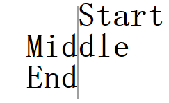

### 目录
- svg实例
- html页面中的svg
  - 1.`<embed>`标签
  - 2.`<object>`标签
  - 3.`<iframe>`标签
- svg常用元素
- svg形状
  - 1.`<rect>`矩形标签
  - 2.`<circle>`圆形标签
  - 3.`<ellipse>`椭圆标签
  - 4.`<line>`线标签
  - 5.`<polyline>`折线标签
  - 6.`<polygon>`多边形标签
  - 7.`<path>`路径标签
- `<text>`文本标签

### svg
> SVG 意为可缩放矢量图形（Scalable Vector Graphics），是用来定义用于网络的基于矢量的图形，是使用 XML 来描述二维图形和绘图程序的语言。
> 图像在放大或改变尺寸的情况下其图形质量不会有所损失
> 所有浏览器均支持 SVG 文件，不过需要安装插件的 Internet Explorer 除外。插件是免费的，比如 [Adobe SVG Viewer](https://www.adobe.com/devnet/svg.html)
> SVG 使用 XML 编写，必须使用`.svg`后缀来保存

#### svg实例
```xml
<?xml version="1.0" standalone="no"?>

<!DOCTYPE svg PUBLIC "-//W3C//DTD SVG 1.1//EN" 
"http://www.w3.org/Graphics/SVG/1.1/DTD/svg11.dtd">

<svg width="100%" height="100%" version="1.1"
xmlns="http://www.w3.org/2000/svg">

<circle cx="100" cy="50" r="40" stroke="black"
stroke-width="2" fill="red"/>

</svg>
```

- 第一行包含了 XML 声明。
  - 请注意 standalone 属性！该属性规定此 SVG 文件是否是“独立的”，或含有对外部文件的引用。
  - `standalone="no"`意味着 SVG 文档会引用一个外部文件,在这里，是 DTD 文件。
- 第二和第三行引用了这个外部的 SVG DTD。该 DTD 位于 “`http://www.w3.org/Graphics/SVG/1.1/DTD/svg11.dtd`”。该 DTD 位于 W3C，含有所有允许的 SVG 元素。
- SVG 代码以`<svg>`元素开始，包括开启标签`<svg>`和关闭标签`</svg>`。这是根元素。
  - width 和 height 属性可设置此 SVG 文档的宽度和高度。
  - version 属性可定义所使用的 SVG 版本
  - xmlns 属性可定义 SVG 命名空间。
- SVG 的`<circle>`用来创建一个圆。
  - cx 和 cy 属性定义圆中心的 x 和 y 坐标。如果忽略这两个属性，那么圆点会被设置为 (0, 0)。
  - r 属性定义圆的半径。
  - stroke 和 stroke-width 属性控制如何显示形状的轮廓。我们把圆的轮廓设置为 2px 宽，黑边框。
  - fill 属性设置形状内的颜色。我们把填充颜色设置为红色。
- 关闭标签的作用是关闭 SVG 元素和文档本身。

#### html页面中的svg
> SVG 文件可通过以下标签嵌入 HTML 文档：`<embed>`、`<object>`或者`<iframe>`

##### 1.`<embed>`标签
`<embed>`标签被所有主流的浏览器支持，并允许使用脚本。

> 当在 HTML 页面中嵌入 SVG 时使用`<embed>`标签是 Adobe SVG Viewer 推荐的方法！然而，如果需要创建合法的 XHTML，就不能使用`<embed>`。任何 HTML 规范中都没有 `<embed>`标签。

```xml
<embed src="rect.svg" width="300" height="100" 
type="image/svg+xml"
pluginspage="http://www.adobe.com/svg/viewer/install/" />
```
- pluginspage 属性指向下载插件的 URL。

##### 2.`<object>`标签
`<object>`标签是 HTML 4 的标准标签，被所有较新的浏览器支持。它的缺点是不允许使用脚本。

> 如果安装了最新版本的 Adobe SVG Viewer，那么当使用`<object>`标签时 SVG 文件无法工作（至少不能在 IE 中工作）！

```xml
<object data="rect.svg" width="300" height="100" 
type="image/svg+xml"
codebase="http://www.adobe.com/svg/viewer/install/" />
```
- codebase 属性指向下载插件的 URL。

##### 3.`<iframe>`标签
`<iframe>`标签可工作在大部分的浏览器中。

```xml
<iframe src="rect.svg" width="300" height="100">
</iframe>
```

#### svg常用元素
|元素|说明|	属性|
--|--|--
`<a>`|创建一个SVG元素周围链接|	xlink:show <br/> xlink:actuate <br/> xlink:href <br/> target
`<circle>`|	定义一个圆|	cx="圆的x轴坐标" <br/> cy="圆的y轴坐标" <br/> r="圆的半径"，必需
`<ellipse>`|	定义一个椭圆|	cx="椭圆x轴坐标" <br/> cy="椭圆y轴坐标" <br/> rx="沿x轴椭圆形的半径"。必需。 <br/> ry="沿y轴长椭圆形的半径"。必需。
`<defs>`|	引用的元素容器	 
`<desc>`|	对 SVG 中的元素的纯文本描述 - 并不作为图形的一部分来显示。用户代理会将其显示为工具提示 
filter|	滤镜效果的容器	 
font|	定义字体	 
font-face|	描述一种字体的特点
`<g>`|	用于把相关元素进行组合的容器元素|	id="该组的名称" <br/> fill="该组填充颜色" <br/> opacity="该组不透明度"
`<image>`|定义图像|	x="图像的左上角的x轴坐标" <br/> y="图像的左上角的y轴坐 <br/> width="图像的宽度". 必须. <br/> height="图像的高度". 必须. <br/> xlink:href="图像的路径". 必须.
`<line>`|	定义一条线|	x1="直线起始点x坐标" <br/> y1="直线起始点y坐标" <br/> x2="直线终点x坐标" <br/> y2="直线终点y坐标"
`<marker>`|	标记可以放在直线，折线，多边形和路径的顶点。这些元素可以使用marker属性的"marker-start"，"marker-mid"和"marker-end"，继承默认情况下或可设置为"none"或定义的标记的URI。您必须先定义标记，然后才可以通过其URI引用。任何一种形状，可以把标记放在里面。他们绘制元素时把它们附加到顶部 | 	markerUnits="strokeWidth'或'userSpaceOnUse"。如果是strokeWidth"那么使用一个单位等于一个笔划宽度。否则，标记尺度不会使用同一视图单位作为引用元素（默认为'strokeWidth'）" <br/> refx="标记顶点连接的位置（默认为0）" <br/> refy="标记顶点连接的位置（默认为0）" <br/> orient="'auto'始终显示标记的角度。 "auto"将计算某个角度使得X轴一个顶点的正切值（默认为0） <br/> markerWidth="标记的宽度（默认3）" <br/> markerHeight="标记的高度（默认3）" <br/> viewBox="各点"看到"这个SVG绘图区域。由空格或逗号分隔的4个值。(min x, min y, width, height)"
`<path>`|	定义一个路径|	d="定义路径指令" <br/> pathLength="如果存在，路径将进行缩放，以便计算各点相当于此值的路径长度" <br/> transform="转换列表 
`<polygon>`|	定义一个包含至少三边图形|	points="多边形的点。点的总数必须是偶数"。必需的。 <br/> fill-rule="FillStroke演示属性的部分"
`<polyline>`|	定义只有直线组成的任意形状|	points=折线上的"点"。必需的。
`<rect>`|	定义一个矩形	|x="矩形的左上角的x轴" <br/> y="矩形的左上角的y轴" <br/> rx="x轴的半径（round元素）" <br/> ry="y轴的半径（round元素）" <br/> width="矩形的宽度"。必需的。 <br/> height="矩形的高度"。必需的。
`<svg>`|	创建一个SVG文档片段	|x="左上角嵌入（默认为0）" <br/> y="左上角嵌入（默认为0）" <br/> width="SVG片段的宽度（默认为100％）" <br/> height="SVG片段的高度（默认为100％）" <br/> viewBox="点"seen"这个SVG绘图区域。由空格或逗号分隔的4个值。 (min x, min y, width, height)" <br/> preserveAspectRatio="'none'或任何'xVALYVAL'的9种组合,VAL是"min"，"mid"或"max"。（默认情况下none）" <br/> zoomAndPan="'magnify' or 'disable'.Magnify选项允许用户平移和缩放您的文件（默认Magnify ）" <br/> xml="最外层`<svg`>元素都需要安装SVG和它的命名空间： `xmlns="http://www.w3.org/2000/svg"` <br/> `xmlns:xlink="http://www.w3.org/1999/xlink" xml:space="preserve"`
`<text>`|	定义一个文本|	x="列表的X -轴的位置。在文本中在第n个字符的位置在第n个x轴。如果后面存在额外的字符，耗尽他们最后一个字符之后放置的位置。 0是默认" <br/> y="列表的Y轴位置。（参考x）0是默认" <br/> dx="在字符的长度列表中移动相对最后绘制标志符号的绝对位置。（参考x）" <br/> dy="在字符的长度列表中移动相对最后绘制标志符号的绝对位置。（参考x）" <br/> rotate="一个旋转的列表。第n个旋转是第n个字符。附加字符没有给出最后的旋转值" <br/> textLength="SVG查看器将尝试显示文本之间的间距/或字形调整的文本目标长度。（默认：正常文本的长度）" <br/> lengthAdjust="告诉查看器，如果指定长度就尝试进行调整用以呈现文本。这两个值是'spacing'和'spacingAndGlyphs'"

#### svg形状
##### 1.`<rect>`矩形标签
```xml
<?xml version="1.0" standalone="no"?>
<!DOCTYPE svg PUBLIC "-//W3C//DTD SVG 1.1//EN" 
"http://www.w3.org/Graphics/SVG/1.1/DTD/svg11.dtd">

<svg width="100%" height="100%" version="1.1"
xmlns="http://www.w3.org/2000/svg">

<rect x="200" y="10" width="300" height="100"
style="fill:rgb(0,0,255);stroke-width:3;stroke:rgb(0,0,0);
fill-opacity:0.1;stroke-opacity:0.9"/>

<rect x="550" y="10" rx="20" ry="20" width="300" height="100"
style="fill:rgb(0,0,255);stroke-width:3;stroke:rgb(0,0,0);
opacity:0.5"/>

</svg>
```

- rect 元素的 width 和 height 属性可定义矩形的高度和宽度
- style 属性用来定义 CSS 属性
- CSS 的 fill 属性定义矩形的填充颜色（rgb 值、颜色名或者十六进制值）
- CSS 的 stroke-width 属性定义矩形边框的宽度
- CSS 的 stroke 属性定义矩形边框的颜色
- x 属性定义矩形的左侧位置（例如，x="0" 定义矩形到浏览器窗口左侧的距离是 0px）
- y 属性定义矩形的顶端位置（例如，y="0" 定义矩形到浏览器窗口顶端的距离是 0px）
- CSS 的 fill-opacity 属性定义填充颜色透明度（合法的范围是：0 - 1）
- CSS 的 stroke-opacity 属性定义笔触颜色的透明度（合法的范围是：0 - 1）
- CSS 的 opacity 属性定义整个元素的透明值（合法的范围是：0 - 1）
- rx 和 ry 属性可使矩形产生圆角

##### 2.`<circle>`圆形标签
```xml
<?xml version="1.0" standalone="no"?>
<!DOCTYPE svg PUBLIC "-//W3C//DTD SVG 1.1//EN" 
"http://www.w3.org/Graphics/SVG/1.1/DTD/svg11.dtd">

<svg width="100%" height="100%" version="1.1"
xmlns="http://www.w3.org/2000/svg">

<circle cx="100" cy="50" r="40" stroke="black"
stroke-width="2" fill="red"/>

</svg>
```

- cx 和 cy 属性定义圆点的 x 和 y 坐标。如果省略 cx 和 cy，圆的中心会被设置为 (0, 0)
- r 属性定义圆的半径

##### 3.`<ellipse>`椭圆标签
```xml
<?xml version="1.0" standalone="no"?>
<!DOCTYPE svg PUBLIC "-//W3C//DTD SVG 1.1//EN" 
"http://www.w3.org/Graphics/SVG/1.1/DTD/svg11.dtd">

<svg width="100%" height="100%" version="1.1"
xmlns="http://www.w3.org/2000/svg">

<ellipse cx="250" cy="250" rx="200" ry="80"
style="fill:rgb(200,100,50);
stroke:rgb(0,0,100);stroke-width:2"/>

</svg>
```

- cx 属性定义圆点的 x 坐标
- cy 属性定义圆点的 y 坐标
- rx 属性定义水平半径
- ry 属性定义垂直半径

##### 4.`<line>`线标签
```xml
<?xml version="1.0" standalone="no"?>
<!DOCTYPE svg PUBLIC "-//W3C//DTD SVG 1.1//EN" 
"http://www.w3.org/Graphics/SVG/1.1/DTD/svg11.dtd">

<svg width="100%" height="100%" version="1.1"
xmlns="http://www.w3.org/2000/svg">

<line x1="10" y1="10" x2="300" y2="300"
style="stroke:rgb(99,99,99);stroke-width:2"/>

</svg>
```

- x1 属性在 x 轴定义线条的开始
- y1 属性在 y 轴定义线条的开始
- x2 属性在 x 轴定义线条的结束
- y2 属性在 y 轴定义线条的结束

##### 5.`<polyline>`折线标签
> 创建仅包含直线的形状
```xml
<?xml version="1.0" standalone="no"?>
<!DOCTYPE svg PUBLIC "-//W3C//DTD SVG 1.1//EN" 
"http://www.w3.org/Graphics/SVG/1.1/DTD/svg11.dtd">

<svg width="100%" height="100%" version="1.1"
xmlns="http://www.w3.org/2000/svg">

<polyline points="0,0 0,20 20,20 20,40 40,40 40,60"
style="fill:white;stroke:red;stroke-width:2"/>

</svg>
```

##### 6.`<polygon>`多边形标签
> 创建含有不少于三个边的图形

```xml
<?xml version="1.0" standalone="no"?>
<!DOCTYPE svg PUBLIC "-//W3C//DTD SVG 1.1//EN" 
"http://www.w3.org/Graphics/SVG/1.1/DTD/svg11.dtd">

<svg width="100%" height="100%" version="1.1"
xmlns="http://www.w3.org/2000/svg">

<!-- 三角形 -->
<polygon points="100,450 180,560 80,550"
style="fill:#cccccc;
stroke:#000000;stroke-width:1"/>

<!-- 四角形 -->
<polygon points="220,100 300,210 170,250 123,234"
style="fill:#cccccc;
stroke:#000000;stroke-width:1"/>

<!-- 五角星 -->
<polygon points="100,10 40,198 190,78 10,78 160,198"
  style="fill:lime;stroke:purple;stroke-width:5;fill-rule:nonzero;" />

</svg>
```

- points 属性定义多边形每个角的 x 和 y 坐标 （points="x1,y1 x2,y2 x3,y3"）
- fill-rule 属性用于指定使用哪一种算法去判断画布上的某区域是否属于该图形“内部” （内部区域将被填充）。对一个简单的无交叉的路径，哪块区域是“内部” 是很直观清除的。但是，对一个复杂的路径，比如自相交或者一个子路径包围另一个子路径，“内部”的理解就不那么明确了。值为 nonzero | evenodd | inherit，默认值:	nonzero。
  - nonzero：字面意思是“非零”。按该规则，要判断一个点是否在图形内，从该点作任意方向的一条射线，然后检测射线与图形路径的交点情况。从0开始计数，路径从左向右穿过射线则计数加1，从右向左穿过射线则计数减1。得出计数结果后，如果结果是0，则认为点在图形外部，否则认为在内部。
  - evenodd：字面意思是“奇偶”。按该规则，要判断一个点是否在图形内，从该点作任意方向的一条射线，然后检测射线与图形路径的交点的数量。如果结果是奇数则认为点在内部，是偶数则认为点在外部。

##### 7.`<path>`路径标签
下面的命令可用于路径数据：
- M = moveto
- L = lineto
- H = horizontal lineto
- V = vertical lineto
- C = curveto
- S = smooth curveto
- Q = quadratic Belzier curve
- T = smooth quadratic Belzier curveto
- A = elliptical Arc
- Z = closepath
> 以上所有命令均允许小写字母。大写表示绝对定位，小写表示相对定位。

```xml
<!-- 定义了一条路径，它开始于位置 250 150，到达位置 150 350，然后从那里开始到 350 350，最后在 250 150 关闭路径 -->
<?xml version="1.0" standalone="no"?>
<!DOCTYPE svg PUBLIC "-//W3C//DTD SVG 1.1//EN" 
"http://www.w3.org/Graphics/SVG/1.1/DTD/svg11.dtd">

<svg width="100%" height="100%" version="1.1"
xmlns="http://www.w3.org/2000/svg">

<path d="M250 150 L150 350 L350 350 Z" />

</svg>
```

###### 螺旋：
```xml
<?xml version="1.0" standalone="no"?>
<!DOCTYPE svg PUBLIC "-//W3C//DTD SVG 1.1//EN" 
"http://www.w3.org/Graphics/SVG/1.1/DTD/svg11.dtd">

<svg width="100%" height="100%" version="1.1"
xmlns="http://www.w3.org/2000/svg">

<path d="M153 334
C153 334 151 334 151 334
C151 339 153 344 156 344
C164 344 171 339 171 334
C171 322 164 314 156 314
C142 314 131 322 131 334
C131 350 142 364 156 364
C175 364 191 350 191 334
C191 311 175 294 156 294
C131 294 111 311 111 334
C111 361 131 384 156 384
C186 384 211 361 211 334
C211 300 186 274 156 274"
style="fill:white;stroke:red;stroke-width:2"/>

</svg>
```

> 由于绘制路径的复杂性，因此强烈建议使用 SVG 编辑器来创建复杂的图形

#### `<text>`文本标签
```xml
<text x="10" y="10" font-size="35" text-anchor="middle" 
fill="red">Hello world</text>

<!-- 空心文字 -->
<text x="10" y="10" font-size="35" text-anchor="middle" 
fill="none" stroke-width="1" stroke="red">Hello world</text>
```

- x 属性为文本的 x 轴坐标
- y 属性为文本的 y 轴坐标
- font-size 属性设置文本字体大小
- text-anchor 属性设置文字的起始坐标
  - `text-anchor="star"`,`<x,y>`为`<text>`的起始坐标
  - `text-anchor="middle"`,`<x,y>`为`<text>`的中轴坐标
  - `text-anchor="end"`,`<x,y>`为`<text>`的结束坐标



- fill 属性设置文字颜色，默认为 black
- stroke 属性默认为 none，如果设置了stroke 并令`fill="none"`，则呈现空心字