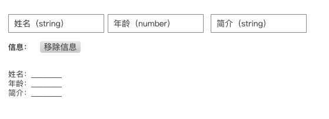

#### 任务目的
- 了解san视图与数据绑定的方式，以及数据校验的方法
- 熟悉san的数据操作相关API
- 练习综合运用san的数据绑定、操作、校验实现视图的交互与变更

#### 任务描述
- 参考下方设计图，使用san实现一个功能

- 输入姓名、年龄和简介信息，实时展示对应的信息
- 点击移除信息按钮后，姓名、年龄和简介信息置空
- 信息的数据类型为一个必须包含name、age和des三个属性的对象，其对应的数据类型分别为string、number和string

#### 任务注意事项
- 请注意代码风格的整齐、优雅
- 代码中含有必要的注释
- 使用san的相关api进行相关功能的实现

#### 在线参考资料
- [https://baidu.github.io/san/tutorial/data-method/](https://baidu.github.io/san/tutorial/data-method/)
- [https://baidu.github.io/san/tutorial/data-checking/](https://baidu.github.io/san/tutorial/data-checking/)