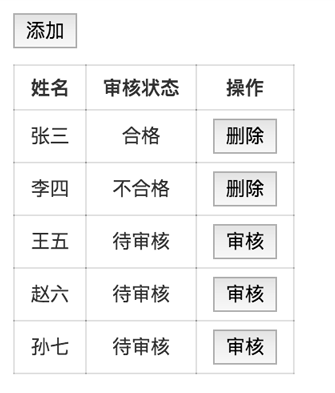

#### 任务目的
- 熟悉San的基础指令
- 掌握San的条件和循环渲染
- 掌握San的常用数组操作方法

#### 任务描述
- 实现如下图所示功能，要求
  - 使用循环指令渲染表格
  - 根据不同的审核状态值，显示对应的状态文案和操作按钮
  - 点击「添加」按钮，增加一条数据项；点击「删除」按钮，删除该条数据；点击「审核」按钮，将审核状态修改为合格

#### 任务注意事项
- 要求实现与任务描述一致
- 请注意代码风格的整齐、优雅

#### 在线学习参考资料
- [条件指令使用教程](https://baidu.github.io/san/tutorial/if/)
- [循环指令使用教程](https://baidu.github.io/san/tutorial/for/)
- [数组操作教程](https://baidu.github.io/san/tutorial/data-method/)