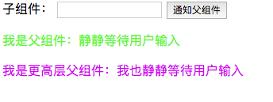
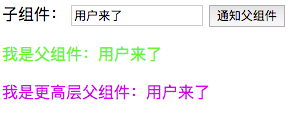

#### 任务目的
1. 熟悉san 事件处理的相关API
2. 对mvvm双向绑定以及san的事件通信有相关了解

#### 任务描述
如示例图：
 

所示，实现以下需求
1. 父组件与高层父组件显示默认值
2. 表单获得焦点输入自定义的信息，点击通知父组件按钮，父组件以及更高层父组件显示输入框内容
3. 父组件及高层父组件接收到子组件的信息时，文案样式发生变化
4. 父组件文案可编辑并能同时控制子组件输入框文案与父组件保持一致（选做）
#### 任务注意事项
- 要求功能实现与任务描述中完全一致
- 示例图仅为参考，样式不需要完全实现一致
- 实现中，尽可能考虑代码的可读性和可复用性
- 请注意代码风格的整齐、优雅
- 代码中含有必要的注释
- 不允许借助任何第三方组件库实现

#### 在线学习参考资料
- [https://baidu.github.io/san/tutorial/event/](https://baidu.github.io/san/tutorial/event/)
- [https://baidu.github.io/san/doc/api/#dispatch](https://baidu.github.io/san/doc/api/#dispatch)
- [https://baidu.github.io/san/doc/api/#fire](https://baidu.github.io/san/doc/api/#fire)
- [https://baidu.github.io/san/tutorial/start/#%E5%8F%8C%E5%90%91%E7%BB%91%E5%AE%9A](https://baidu.github.io/san/tutorial/start/#%E5%8F%8C%E5%90%91%E7%BB%91%E5%AE%9A)