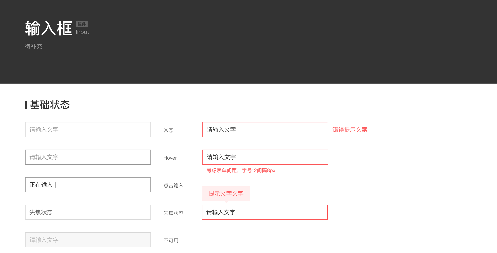
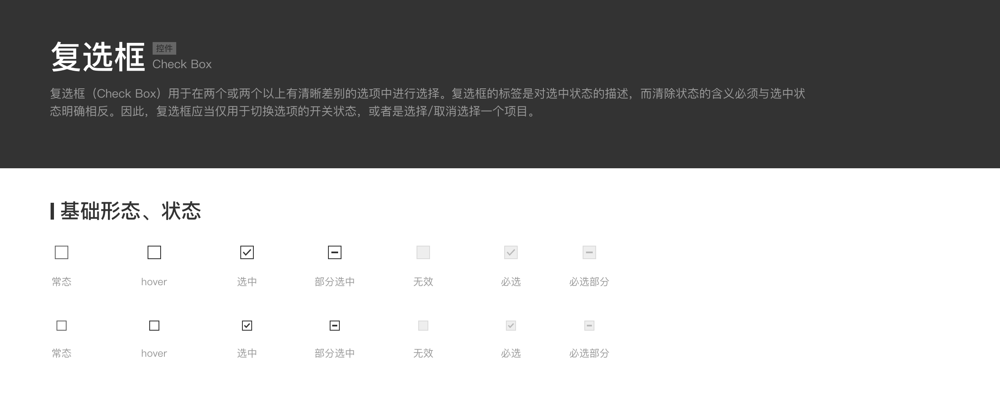

### 任务目的
- 理解并学会使用san的表单API
- 学习如何封装表单组件

### 任务描述
- 利用san提供的API实现简单的表单控件
- 根据给出的设计稿实现自定义的Input、Checkbox组件，并满足给定的API

#### Input
</table><p><strong>props</strong></p>
<table class="table table-bordered table-hover"><tr>
<th style="text-align:left">属性</th>
<th style="text-align:left">类型</th>
<th style="text-align:left">默认值</th>
<th style="text-align:left">说明</th>
</tr>
<tr>
<td style="text-align:left">value</td>
<td style="text-align:left">string</td>
<td style="text-align:left">空</td>
<td style="text-align:left">双绑定的值</td>
</tr>
<tr>
<td style="text-align:left">placeholder</td>
<td style="text-align:left">string</td>
<td style="text-align:left">空</td>
<td style="text-align:left">站位文本</td>
</tr>
<tr>
<td style="text-align:left">disabled</td>
<td style="text-align:left">boolean</td>
<td style="text-align:left">false</td>
<td style="text-align:left">是否禁用</td>
</tr>
<tr>
<td style="text-align:left">readonly</td>
<td style="text-align:left">boolean</td>
<td style="text-align:left">false</td>
<td style="text-align:left">是否只读</td>
</tr>

</table><p><strong>events</strong></p>
<table class="table table-bordered table-hover"><tr>
<th style="text-align:left">事件</th>
<th style="text-align:left">说明</th>
<th style="text-align:left">返回值</th>
</tr>
<tr>
<td style="text-align:left">on-input</td>
<td style="text-align:left">输入时触发</td>
<td style="text-align:left">event</td>
</tr>
<tr>
<td style="text-align:left">on-focus</td>
<td style="text-align:left">获得焦点时触发</td>
<td style="text-align:left">event</td>
</tr>
<tr>
<td style="text-align:left">on-blur</td>
<td style="text-align:left">失去焦点时触发</td>
<td style="text-align:left">event</td>
</tr>

##### 使用形式
```js
    <san-input
        value="{{value}}"
    />
    <san-input
        placehold="请输入用户名"
        value="{{value}}"
    />
    <san-input
        on-input="handleInput"
        placehold="请输入用户名"
        value="{{value}}"
    />
```

#### Checkbox
<p><strong>props</strong></p>
<table class="table table-bordered table-hover"><tr>
<th>属性</th>
<th>类型</th>
<th>必须</th>
<th>默认值</th>
<th>说明</th>
</tr>
<tr>
<td>checked</td>
<td>Boolean</td>
<td>string</td>
<td>false</td>
<td>组件的值，如果使用了trueValue和falseValue则为对应字符串，否则为boolean</td>
</tr>
<tr>
<td>disabled</td>
<td>Boolean</td>
<td>false</td>
<td>false</td>
<td>是否禁用当前项</td>
</tr>
<tr>
<td>trueValue</td>
<td>String</td>
<td>false</td>
<td>-</td>
<td>选中时的值</td>
</tr>
<tr>
<td>falseValue</td>
<td>String</td>
<td>false</td>
<td>-</td>
<td>未选中时的值</td>
</tr>
<tr>
<td>indeterminate</td>
<td>Boolean</td>
<td>false</td>
<td>false</td>
<td>设置 indeterminate 状态，只负责样式控制</td>
</tr>

</table><p><strong>event</strong></p>
<table class="table table-bordered table-hover"><tr>
<th>事件</th>
<th>说明</th>
<th>返回值</th>
</tr>
<tr>
<td>on-change</td>
<td>触发原生的change事件，通过修改外部的数据改变时不会触发</td>
<td>events对象</td>
</tr>
</table>

##### 使用形式
```js
    <san-checkbox checked="{=checked=}">
        是否开启
    </san-checkbox>
    <san-checkbox
        on-change="handleChange"
        checked="{=dynimicValueTrue=}"
    >
    是否同意协议
    </san-checkbox>
```

##### 图标svg代码
```js
<?xml version="1.0" standalone="no"?><!DOCTYPE svg PUBLIC "-//W3C//DTD SVG 1.1//EN" "http://www.w3.org/Graphics/SVG/1.1/DTD/svg11.dtd"><svg t="1522742656342" class="icon" style="" viewBox="0 0 1024 1024" version="1.1" xmlns="http://www.w3.org/2000/svg" p-id="1942" xmlns:xlink="http://www.w3.org/1999/xlink" width="200" height="200"><defs><style type="text/css"></style></defs><path d="M832 928.00086l-640 0c-52.9288 0-96.00086-43.07206-96.00086-95.99914l0-640c0-52.9288 43.07206-96.00086 96.00086-96.00086l640 0c52.92708 0 95.99914 43.07206 95.99914 96.00086l0 640C928.00086 884.9288 884.9288 928.00086 832 928.00086zM192 160.00086c-17.632039 0-32.00086 14.368821-32.00086 32.00086l0 640c0 17.664722 14.368821 31.99914 32.00086 31.99914l640 0c17.664722 0 31.99914-14.336138 31.99914-31.99914l0-640c0-17.632039-14.336138-32.00086-31.99914-32.00086L192 160.00086z" p-id="1943"></path></svg>
```
```js
<?xml version="1.0" standalone="no"?><!DOCTYPE svg PUBLIC "-//W3C//DTD SVG 1.1//EN" "http://www.w3.org/Graphics/SVG/1.1/DTD/svg11.dtd"><svg t="1522742638607" class="icon" style="" viewBox="0 0 1024 1024" version="1.1" xmlns="http://www.w3.org/2000/svg" p-id="1828" xmlns:xlink="http://www.w3.org/1999/xlink" width="200" height="200"><defs><style type="text/css"></style></defs><path d="M832 96.00086l-640 0c-52.9288 0-96.00086 43.07206-96.00086 96.00086l0 640c0 52.92708 43.07206 95.99914 96.00086 95.99914l640 0c52.92708 0 95.99914-43.07206 95.99914-95.99914l0-640C928.00086 139.0712 884.9288 96.00086 832 96.00086zM727.231286 438.432254 471.00766 697.439161c-0.063647 0.063647-0.192662 0.096331-0.25631 0.192662-0.096331 0.063647-0.096331 0.192662-0.192662 0.25631-2.048757 1.983389-4.575729 3.19957-6.944443 4.544765-1.183497 0.672598-2.143368 1.696116-3.392232 2.176052-3.839484 1.536138-7.904314 2.33603-11.967424 2.33603-4.095794 0-8.224271-0.799892-12.096439-2.399677-1.279828-0.543583-2.303346-1.632469-3.519527-2.303346-2.368714-1.343475-4.832039-2.528692-6.880796-4.544765-0.063647-0.063647-0.096331-0.192662-0.159978-0.25631-0.063647-0.096331-0.192662-0.096331-0.25631-0.192662l-126.016611-129.503454c-12.320065-12.672705-12.032791-32.928047 0.639914-45.248112 12.672705-12.287381 32.895364-12.063755 45.248112 0.639914l103.26354 106.112189 233.279613-235.808305c12.416396-12.576374 32.704421-12.672705 45.248112-0.25631C739.520387 405.631501 739.647682 425.888563 727.231286 438.432254z" p-id="1829"></path></svg>
```

#### 任务注意事项
1. 第一个任务，可以参考san官网的API文档。
2. 第二个任务，实现时要满足给定了API和使用形式，除此之外可以扩展组件的属性和事件API，以满足跟多的业务场景。比如Input的type属性，click事件等。
3. checkbox组件实现过程中会用到icon来展示选中和未选中状态，可以考虑使用svg或者第三方图标库来实现。

#### 设计稿



#### 参考资料
<ol>
<li><a href="https://baidu.github.io/san/tutorial/form/">san官方文档-表单</a></li>
<li><a href="http://www.cnblogs.com/wangmeijian/p/4614959.html">checkbox的indeterminate属性</a></li>
</ol>