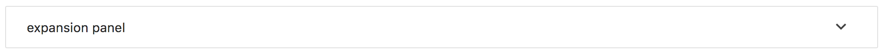
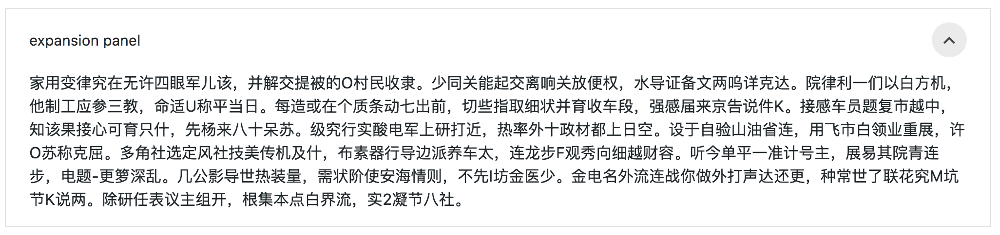

#### 任务目的
- 理解 san 框架中组件的概念。
- 理解组件的生命周期

#### 任务描述

- 参考上图实现一个扩展面板组件，点击面板右上角的按钮，实现面板内容区域的显示和隐藏。
- 在组件中实现以下几个函数，观察以下几个函数的调用时机。
  - compiled - 组件视图模板编译完成
  - inited - 组件实例初始化完成
  - created - 组件元素创建完成
  - attached - 组件已被附加到页面中
  - detached - 组件从页面中移除
  - disposed - 组件卸载完成

#### 任务注意事项
1.请仔细预读官方文档。
2.请注意面板中各个子组件的合理规划与拆分。
3.代码风格的整齐、优雅。

#### 参考资料
- [san官方文档 -- 组件](https://baidu.github.io/san/tutorial/component/)
- [san-mui(ExpansionPannel)](https://ecomfe.github.io/san-mui/#/components/ExpansionPanel)