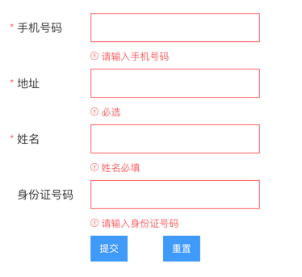

#### 任务目的
学习如何用San来封装支持自定义验证的表单

#### 任务描述
- 根据给出的设计稿实现支持自定义验证的表单组件，并满足给定的API
- 学习如何利用开源社区中比较成熟的库
- 可以自己扩展实现更复杂的表单组件，尝试将日历组件、下拉组件集成到表单组件中

<h3 id="form">Form</h3>
<p><strong>props</strong></p>
<table class="table table-bordered table-hover"><tr>
<th>名称</th>
<th>类型</th>
<th>必须</th>
<th>默认值</th>
<th>描述</th>
</tr>
<tr>
<td>labelWidth</td>
<td>String</td>
<td>false</td>
<td>100px</td>
<td>标签宽度，带单位的宽度值，如100px，影响这个表单</td>
</tr>
<tr>
<td>rules</td>
<td>Object</td>
<td>false</td>
<td>[]</td>
<td>验证规则</td>
</tr>
<tr>
<td>labelPosition</td>
<td>String</td>
<td>false</td>
<td>left</td>
<td>标签位置，影响整个表单，可选值为top,right,left。</td>
</tr>
</table><p><strong>event</strong></p>
<table class="table table-bordered table-hover"><tr>
<th>方法</th>
<th>说明</th>
<th>返回值</th>
</tr>
<tr>
<td>validate</td>
<td>对表单执行验证</td>
<td>-</td>
</tr>
<tr>
<td>validateField</td>
<td>对单一的表单控件执行验证</td>
<td>-</td>
</tr>
<tr>
<td>resetFields</td>
<td>重置所有表单</td>
<td>-</td>
</tr>
</table><h3 id="formitem">FormItem</h3>
<p><strong>props</strong></p>
<table class="table table-bordered table-hover"><tr>
<th>名称</th>
<th>类型</th>
<th>必须</th>
<th>默认值</th>
<th>描述</th>
</tr>
<tr>
<td>require</td>
<td>Boolean</td>
<td>false</td>
<td>false</td>
<td>是否必填项</td>
</tr>
<tr>
<td>label</td>
<td>String</td>
<td>false</td>
<td>-</td>
<td>标签名称</td>
</tr>
<tr>
<td>labelWidth</td>
<td>String</td>
<td>false</td>
<td>100px</td>
<td>标签宽度，带单位的宽度值，如100px</td>
</tr>
<tr>
<td>prop</td>
<td>String</td>
<td>false</td>
<td>-</td>
<td>formModel中的字段</td>
</tr>
<tr>
<td>rules</td>
<td>Array</td>
<td>false</td>
<td>[]</td>
<td>验证规则</td>
</tr>
<tr>
<td>error</td>
<td>String</td>
<td>false</td>
<td>-</td>
<td>错误信息，外部传入，改变组件的验证状态，仅做提示</td>
</tr>
<tr>
<td>helpText</td>
<td>String</td>
<td>false</td>
<td>-</td>
<td>帮助信息</td>
</tr>
<tr>
<td>labelPosition</td>
<td>String</td>
<td>false</td>
<td>left</td>
<td>标签位置，可选值为top,right,left。</td>
</tr>

##### 使用形式
```html
<template>
    <div class="demo-section">
        <ui-form
            formModel="{=formModel=}"
            san-ref="formModel">
            <ui-form-item
                rules="{{ruleMobile}}"
                prop="mobile"
                helpText="请输入手机号码"
                label="手机号码">
                <ui-input
                    value="{=formModel.mobile=}"
                ></ui-input>
            </ui-form-item>
            <ui-form-item
                rules="{{ruleAddress}}"
                prop="address"
                helpText="请输入地址"
                label="地址">
                <ui-input
                    value="{=formModel.address=}"
                ></ui-input>
            </ui-form-item>
            <ui-form-item
                prop="userName"
                require="{{true}}"
                helpText="输入姓名与身份证保持一致"
                label="姓名">
                <ui-input
                    value="{=formModel.userName=}"
                ></ui-input>
            </ui-form-item>
            <ui-form-item
                rules="{{ruleIdCard}}"
                prop="idCard"
                helpText="根据国家相关规定，需要您输入身份证号码"
                label="身份证号码">
                <ui-input
                    value="{=formModel.idCard=}"
                ></ui-input>
            </ui-form-item>
            <ui-form-item>
                <ui-button class="submit-button" on-click="submitForm('formModel')" ui="primary small">提交</ui-button>
                <ui-button class="submit-button" on-click="resetForm('formModel')" ui="primary small">重置</ui-button>
            </ui-form-item>
        </ui-form>
    </div>
</template>

<script>
import Form from '../../../src/components/Form';
import FormItem from '../../../src/components/FormItem';
import Input from '../../../src/components/Input';
import Button from '../../../src/components/Button';
export default {
    components:{
        'ui-button': Button,
        'ui-form': Form,
        'ui-form-item': FormItem,
        'ui-input': Input
    },
    initData() {
        const idCardValidate = (rule, value, callback) => {
            if (value) {
                // 异步、远程验证
                let userName = this.data.get('formModel.userName');
                console.log({
                    userName,
                    idCard: value
                });
                // 将用户名和身份证号码作为参数发送异步请求，到服务端验证
                setTimeout(function() {
                    callback([new Error('您输入的身份信息不匹配')]);
                }, 1000);
            }
            else {
                setTimeout(function() {
                    callback(['请输入身份证号码']);
                }, 1000);
            }
        };

        return {
            formModel: {
                mobile: '',
                userName: '',
                idCard: '',
                address: ''
            },
            ruleMobile: [
                {
                    type: 'string',
                    required: true,
                    message: '请输入手机号码'
                },
                {
                    validator(rule, value, callback) {
                        if (value) {
                            if (!/^[1][3,4,5,7,8][0-9]{9}$/.test(value)) {
                                callback([new Error('请输入正确的手机号码!')]);
                            }
                            else {
                                callback([]);
                            }
                        }
                        else {
                            callback([new Error('请输入手机号码!')]);
                        }
                    }
                }
            ],
            ruleAddress: [
                {
                    required: true,
                    message: '必选',
                    type: 'string'
                },
                {

                    min: 6,
                    message: '用户名需不少于6个字符'
                },
                                {
                    max: 20,
                    message: '用户名需不超过20个字符'
                }
            ],
            ruleIdCard: [
                {
                    type: 'string',
                    require: true
                },
                {
                    validator: idCardValidate
                }
            ]
        };
    },
    submitForm(formName) {
        let formModel = this.data.get(formName);
        if (formName === 'formModel') {
            this.data.set('formStatus', 'validating');
        }
        this.ref(formName).validate((valid) => {
            this.data.set('formStatus', 'validateEnd');
            if (valid) {
                // 验证成功 do someThing
                console.log(formModel);
            } else {
                // 验证失败 do someThing
                console.log(valid)
            }
        });
    },
    resetForm(formName) {
        this.ref(formName).resetFields();
    }
}
</script>
```

#### 参考资料
- [数据验证工具](https://github.com/yiminghe/async-validator)
- [箭头函数](https://www.liaoxuefeng.com/wiki/1022910821149312/1031549578462080)

#### 设计稿
