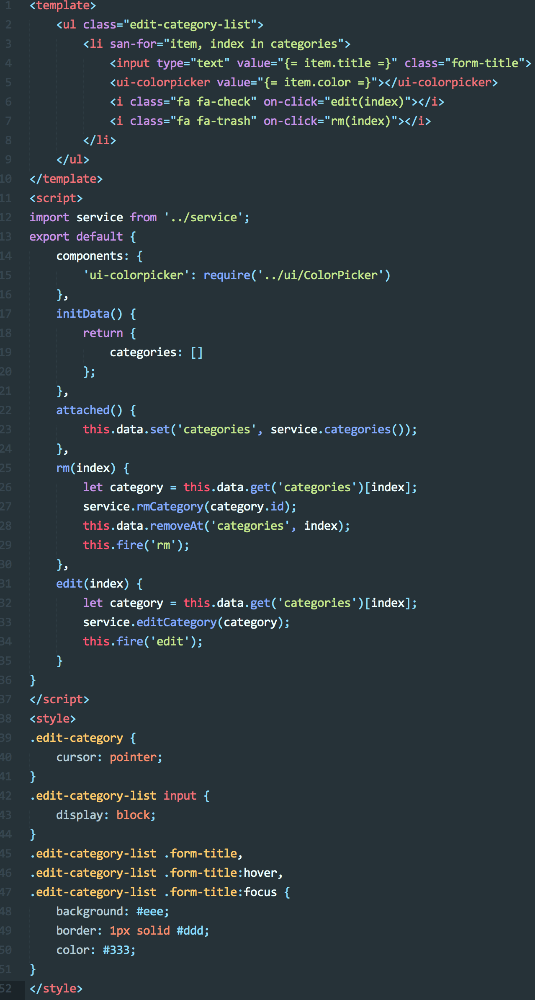

#### 任务目的
- 增强对`San`语法的熟悉度;
- 考察快速学习能力;

#### 任务描述
- 学习如何基于`Sublime Text 3`拓展插件;
- 调研基于.san文件开发方式下语法高亮的实现;
- 完成基于`Sublime Text 3`的`San-ST3-highlight`并发布到个人主页(Github);
- 实现样例:

#### 任务注意事项
- `(提出问题) - 分析问题 - 拆分问题 - 解决问题`是我们期望你具备的能力;
- `Talk is cheap`，实践出真知;

#### 在线学习参考资料
- [YAML spec]()
- [ST3 documentation]()